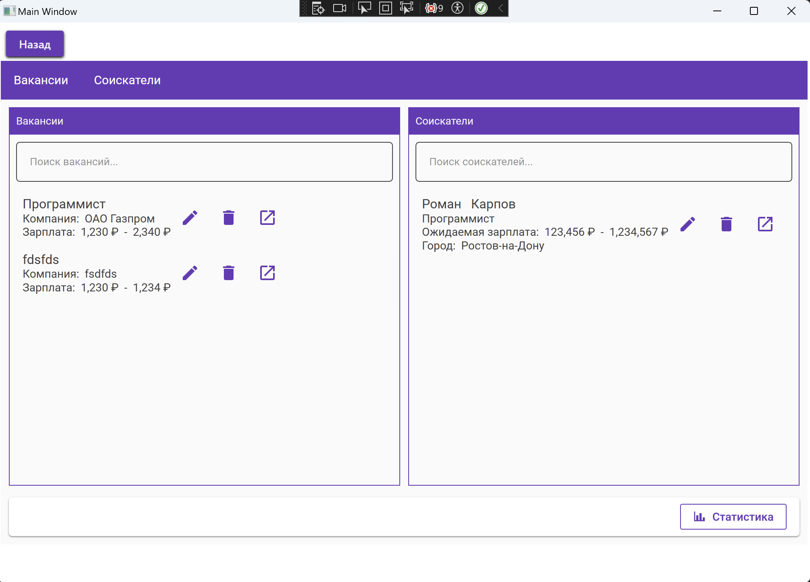
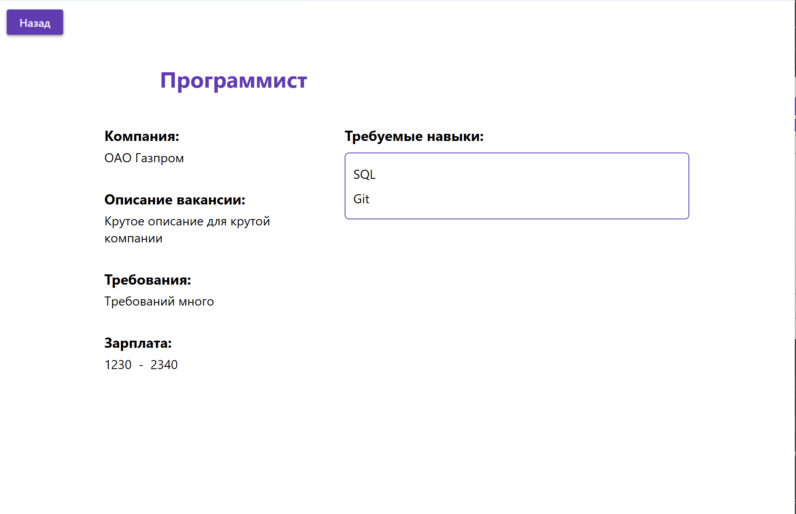
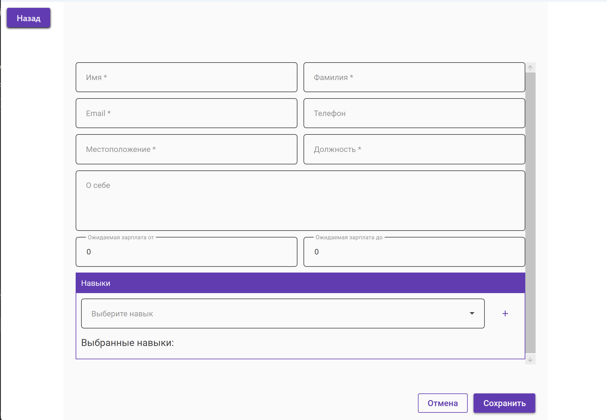
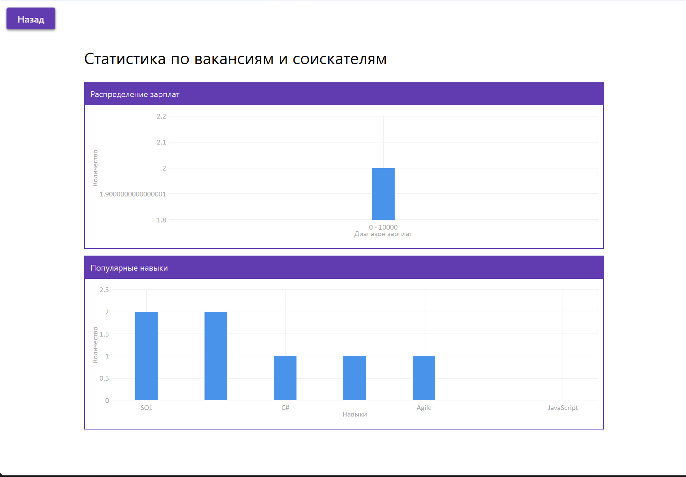

# HRCompany

Используемые технологии:
- C# (WPF)
- PostgreSQL (EntityFramework)
- MVVM
- Dependency Injection

## Главное меню приложения
Позволяет добавить, удалить, отредактировать, посмотреть полностью и найти по ключевым параметрам вакансию.

> Вакансии и соискатели имеют подобную функциональность в общем случае 

## Страница просмотра

Позволяет просмотреть подробную информацию

## Страница резюме соискателя

Позволяет создать (или отредактировать) резюме

## Страница статистики

Позволяет посмотреть статистику по вакансиям и резюме по заработной плате или требуемым на рынке навыкам

